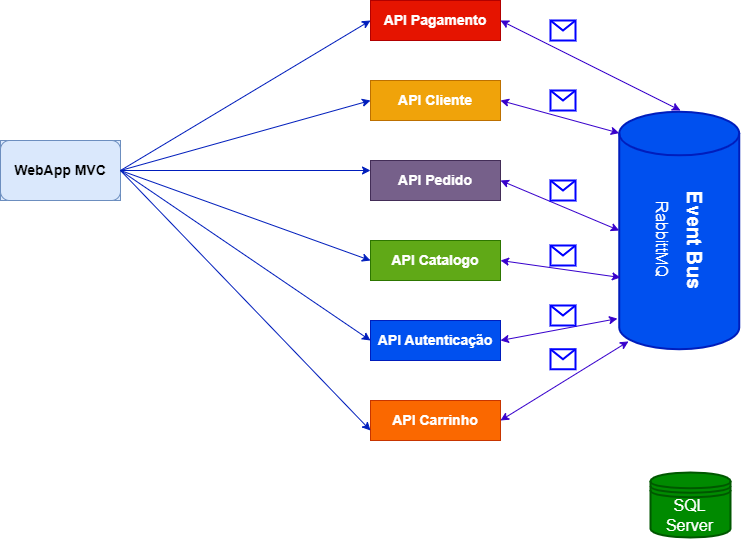

# Ecommerce

Projeto e-commerce desenvolvido com a tecnologia ASPNET, seguindo uma estrutura distribuida.

- Diagrama da arquitetura distribuida do projeto e-commerce

# Migrations

instalar global -> dotnet tool install --global dotnet-ef

- Criar Migration

otnet ef migrations add [NOME]

ou

Add-Migration [NOME]

- Criar seu esquema e banco de dados

dotnet ef database update

ou

update-database
